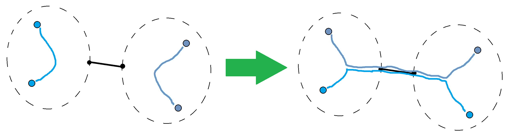

> 题目链接：https://codeforces.com/contest/700/problem/B

## 思路：

考虑每一条边对答案的贡献

对于每一条边，设它左右两侧的关键节点数量分别为 x , y ，那么最多会有 **min(x, y)** 个路径会经过这条边

那么我能够保证对于每一条边都能取到最大值吗？答案是确定的

观察易得，经过中间那条边的路径数量的奇偶性是不变的



如果经过当前边的数量小于最大值，那么两边一定各有偶数个点互相连接，我们可以让他们经过当前边，如上图所示

由于本题给的路径是一棵树，所以我们可以从根节点的某一条边作为分界点，让两侧的子树的关键节点都经过该边，所以我们就能够证明每条边的最大值都能够取到

所以遍历每一条边，假设以当前节点为子树的关键节点数量为cnt，这条边对答案的贡献就是 **min(cnt, k * 2 - cnt)**

## Code:

```cpp
int main(){
    ios::sync_with_stdio(false);
    cin.tie(nullptr);
    int n,k;
    cin >> n >> k;
    vector<bool> c(n + 1);
    for (int i = 0; i < k * 2; i++) {
        int x;
        cin >> x;
        c[x] = true;
    }
    vector<vector<int>> adj(n + 1);
    for (int i = 0; i < n - 1; i++) {
        int u,v;
        cin >> u >> v;
        adj[u].push_back(v);
        adj[v].push_back(u);
    }

    ll ans = 0;
    auto dfs = [&](auto && dfs,int u,int p) -> int {
        int cnt = c[u];
        for (int v : adj[u]) {
            if (v == p) continue;
            cnt += dfs(dfs,v,u);
        }
        ans += min(cnt, k * 2 - cnt);
        return cnt;
    };
    dfs(dfs,1,0);
    cout << ans << '\n';
    return 0;
}
```

